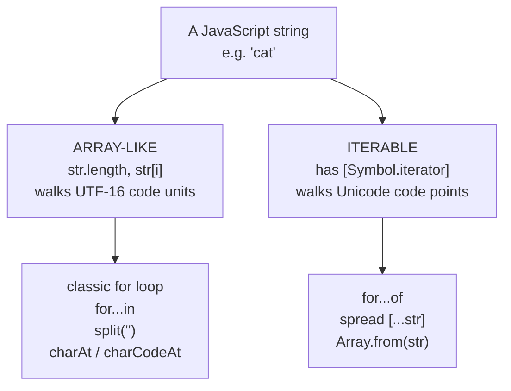
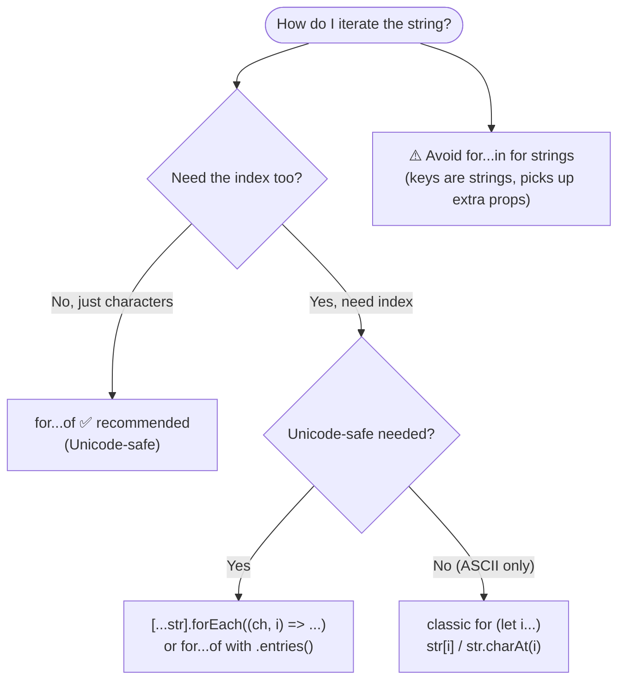
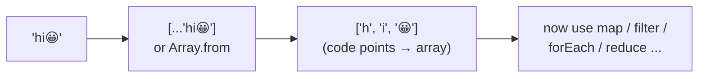
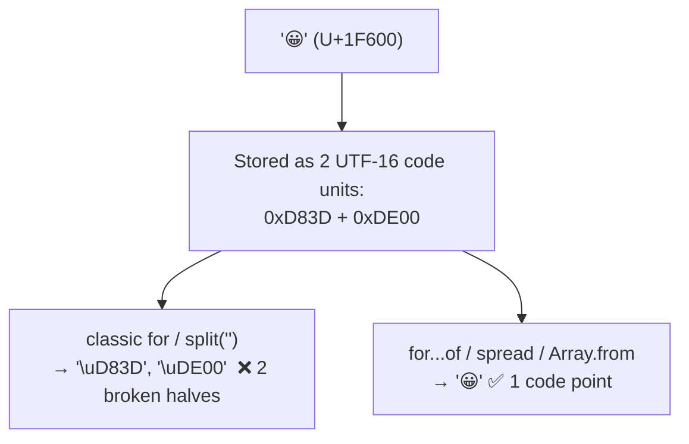

# Iterating Over a String in JavaScript

> **Tip:** Open VS Code's Markdown preview with `Ctrl+Shift+V` to see the Mermaid diagrams. They also render on GitHub. See [`Iterating-over-string.js`](./Iterating-over-string.js) for runnable demos and [`Iterating-over-string-interview-questions.md`](./Iterating-over-string-interview-questions.md) for interview prep.

A JavaScript string is both **array-like** (it has a `.length` and is index-accessible via `str[i]`) **and iterable** (it has a built-in `[Symbol.iterator]`). That gives us several ways to walk through it — but they are **not** equivalent. The big divide is **UTF‑16 code units vs Unicode code points** (this is what breaks emojis 😀).

---

## 1. The Key Idea



- **Strings are immutable** — iterating only *reads* characters; you can never assign `str[0] = 'x'`.
- The **code-unit** family (classic `for`, `split('')`) splits surrogate pairs and mangles characters outside the Basic Multilingual Plane (emojis, some CJK, etc.).
- The **code-point** family (`for...of`, spread, `Array.from`) handles those correctly.

---

## 2. The Methods at a Glance



---

## 3. Classic `for` Loop (index based)

The traditional way. You control the index, so you can skip, step, or go backwards. Operates on **UTF‑16 code units**.

```js
const str = "code";
for (let i = 0; i < str.length; i++) {
  console.log(i, str[i]);   // str.charAt(i) is equivalent
}
// 0 'c'  1 'o'  2 'd'  3 'e'
```

| Accessor | Returns | Out of range |
|----------|---------|--------------|
| `str[i]` | the character (1-char string) | `undefined` |
| `str.charAt(i)` | the character (1-char string) | `""` (empty string) |
| `str.charCodeAt(i)` | UTF‑16 code unit (0–65535) | `NaN` |
| `str.codePointAt(i)` | full Unicode code point | `undefined` |

> Use this when you need the **index**, need to **step/skip/reverse**, or you're 100% on ASCII and want raw speed.

---

## 4. `for...of` — the Modern, Recommended Way

Uses the string's iterator, so it yields **Unicode code points** — emojis stay intact. Cleanest syntax when you only need the characters.

```js
for (const ch of "ab😀") {
  console.log(ch);
}
// 'a'  'b'  '😀'   ← emoji is ONE iteration
```

Need the index as well? Spread into an array first and use `.entries()` / `forEach`:

```js
for (const [i, ch] of [..."ab😀"].entries()) {
  console.log(i, ch);   // 0 'a'  1 'b'  2 '😀'
}
```

---

## 5. Spread `[...str]` and `Array.from(str)`

Both turn a string into an **array of code points** (Unicode-safe), after which any array method (`map`, `filter`, `forEach`, `reduce`…) is available.

```js
[..."hi😀"];              // ['h', 'i', '😀']
Array.from("hi😀");       // ['h', 'i', '😀']

// Array.from also takes a map function:
Array.from("abc", c => c.toUpperCase());  // ['A', 'B', 'C']

// forEach with index:
[..."abc"].forEach((ch, i) => console.log(i, ch));
```



---

## 6. `for...in` — Avoid for Strings ⚠️

`for...in` iterates **enumerable keys**, which for a string are the **indices as strings** (`"0"`, `"1"`, …). It is meant for object properties, not sequences.

```js
for (const i in "abc") {
  console.log(i, typeof i);   // "0" string,  "1" string,  "2" string
}
```

Problems:
- `i` is a **string** key, not a number — `i + 1` gives `"01"`, not `1`.
- It can pick up **inherited / added enumerable properties** on `String.prototype`.
- Iteration **order is not guaranteed** by spec (in practice ordered for integer keys, but don't rely on it).

> Rule of thumb: **`for...in` for objects, `for...of` for strings/arrays/iterables.**

---

## 7. The Unicode Gotcha (Why `for...of` Wins)

A character like `😀` is stored as **two** UTF‑16 code units (a *surrogate pair*). Index-based access sees those halves separately; iterators see the whole code point.



```js
const s = "😀";
s.length;            // 2  ← code UNITS, not characters!
s[0];                // '\uD83D'  (broken half)
[...s].length;       // 1  ← code POINTS
[...s][0];           // '😀'  (intact)
"😀".split("");      // ['\uD83D', '\uDE00']  ❌ splits the pair
[..."😀"];           // ['😀']                 ✅ correct
```

So `"😀".length === 2` and `"a".length === 1`. If you ever need the **true character count**, use `[...str].length`, not `str.length`.

---

## 8. Comparison Table

| Method | Yields | Index available? | Unicode-safe? | Notes |
|--------|--------|------------------|---------------|-------|
| `for (let i…)` + `str[i]` | code units | ✅ (you own `i`) | ❌ | Most control; fastest; ASCII-friendly |
| `for...of` | code points | ❌ (use `.entries()`) | ✅ | **Recommended** for characters |
| `[...str]` / `Array.from` | code points (array) | ✅ via array | ✅ | Unlocks `map`/`filter`/`reduce` |
| `str.split("")` | code units (array) | ✅ via array | ❌ | Breaks surrogate pairs |
| `for...in` | index **strings** | ✅ (as strings) | ❌ | **Avoid** — for objects, not strings |

---

## Quick Summary

- A string is **array-like** (`.length`, `str[i]`) **and iterable** (`[Symbol.iterator]`); strings are **immutable**.
- **`for...of`** is the modern default for reading characters — clean and **Unicode-safe**.
- **Classic `for`** when you need the **index** or want to step/skip/reverse (code units; fine for ASCII).
- **`[...str]` / `Array.from(str)`** → array of code points, then use array methods; `Array.from` also takes a map fn.
- **`split("")`** and index access work on **UTF‑16 code units** → they **break emojis / surrogate pairs**.
- **Avoid `for...in`** for strings — it yields index **strings** and can pick up extra enumerable props.
- True character count = `[...str].length`, not `str.length`.
