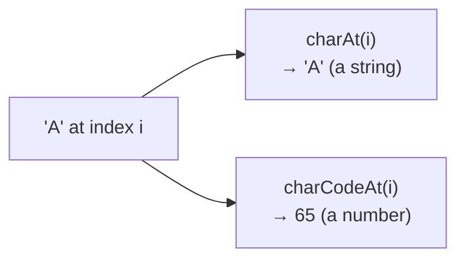
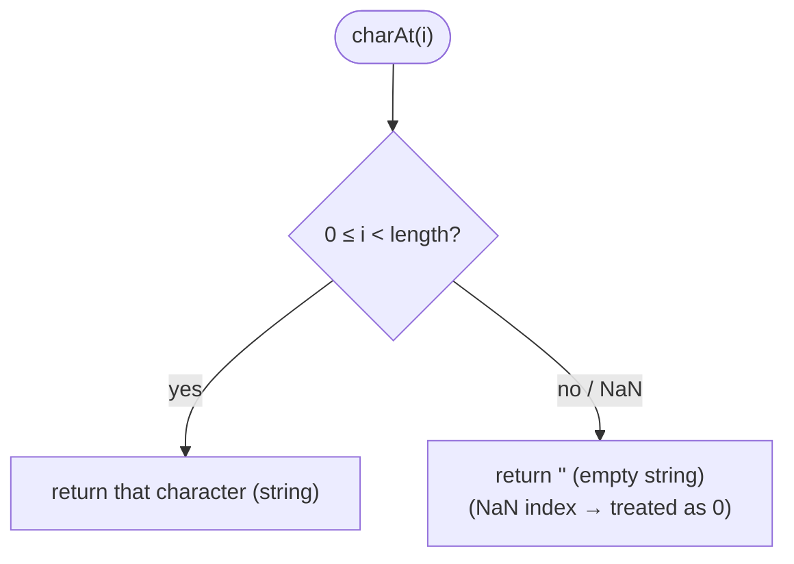
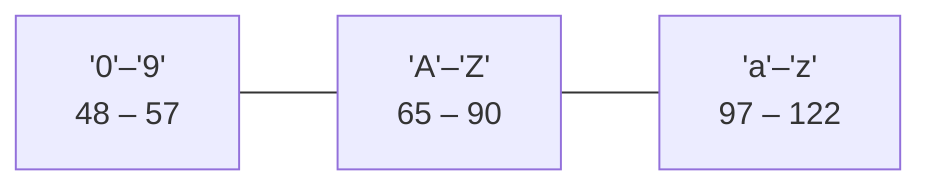
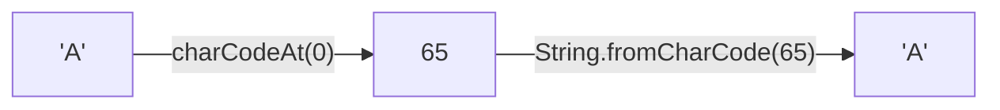
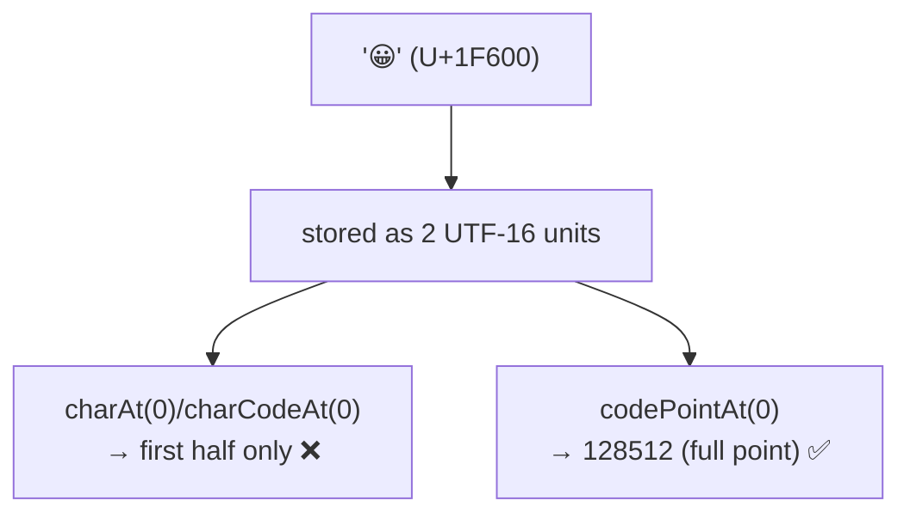

# String Methods — `charAt()` & `charCodeAt()`

> **Tip:** Open VS Code's Markdown preview with `Ctrl+Shift+V` to see the Mermaid diagrams. They also render on GitHub. See [`charAt-and-charCodeAt.js`](./charAt-and-charCodeAt.js) for runnable demos and [`charAt-and-charCodeAt-interview-questions.md`](./charAt-and-charCodeAt-interview-questions.md) for interview prep. Related: [Iterating over a string](./Iterating-over-string.md).

Both methods read **one position** of a string by index. The difference is **what they hand back**:

- **`charAt(i)`** → the **character** (a one-character string).
- **`charCodeAt(i)`** → the **number** (the UTF‑16 code unit, 0–65535).



Both operate on **UTF‑16 code units** (not full Unicode code points) and never mutate the string — strings are immutable.

---

## 1. `charAt(index)`

Returns a **new one-character string** for the UTF‑16 code unit at `index`.

```js
const s = "JAVA";
s.charAt(0);   // 'J'
s.charAt(2);   // 'V'
s.charAt();    // 'J'  ← no arg ⇒ index defaults to 0
```

**Edge cases:**

| Input | Result | Why |
|-------|--------|-----|
| `"abc".charAt(5)` | `""` | out of range → **empty string** |
| `"abc".charAt(-1)` | `""` | negative → out of range |
| `"abc".charAt()` | `"a"` | missing arg → index `0` |
| `"abc".charAt(1.9)` | `"b"` | index **truncated** to `1` |
| `"abc".charAt("x")` | `"a"` | non-numeric → `NaN` → coerced to `0` |



### `charAt(i)` vs bracket access `str[i]`

```js
"abc"[1];        // 'b'   (same character)
"abc".charAt(1); // 'b'

"abc"[9];        // undefined   ← bracket: out of range
"abc".charAt(9); // ''          ← charAt: out of range
```

| | `str.charAt(i)` | `str[i]` |
|---|---|---|
| Out of range | `""` (empty string) | `undefined` |
| Non-numeric / missing index | coerced to `0` | `undefined` |
| Style | method call | terser, array-like |

> Use **`charAt`** when you want an empty-string fallback or maximal compatibility; **`str[i]`** is the modern, terser choice when an `undefined` for out-of-range is fine.

---

## 2. `charCodeAt(index)`

Returns an integer **0–65535** = the UTF‑16 code unit at `index`. Out of range → **`NaN`**.

```js
"A".charCodeAt(0);   // 65
"a".charCodeAt(0);   // 97
"0".charCodeAt(0);   // 48
" ".charCodeAt(0);   // 32
"abc".charCodeAt(9); // NaN  ← out of range
"abc".charCodeAt();  // 97   ← defaults to index 0 → 'a'
```

Handy ASCII anchors to memorise:



Note `'a' (97) − 'A' (65) = 32` — the constant gap between lower- and upper-case letters.

### The inverse: `String.fromCharCode(...)`

`charCodeAt` turns a character into a number; **`String.fromCharCode`** turns numbers back into a string. (It's a **static** method on `String`, not called on an instance.)

```js
"A".charCodeAt(0);                 // 65
String.fromCharCode(65);           // 'A'
String.fromCharCode(72, 73);       // 'HI'  ← multiple codes
```



---

## 3. The Unicode Caveat — code **units**, not code **points**

Both methods see **UTF‑16 code units**. A character outside the Basic Multilingual Plane (e.g. `😀`, U+1F600) is stored as **two** code units (a *surrogate pair*), so:

```js
const e = "😀";
e.length;            // 2          ← two code units
e.charAt(0);         // '\uD83D'   ← only the FIRST half (broken)
e.charCodeAt(0);     // 55357      ← code of that half, NOT 128512
e.codePointAt(0);    // 128512     ← the FULL code point ✅
```



> For non-BMP text use **`codePointAt`** + **`String.fromCodePoint`**, the code-point-aware counterparts. For plain ASCII / BMP text, `charAt` / `charCodeAt` are perfectly fine.

---

## 4. Why `charCodeAt` Is Useful — Common Patterns

```js
// 1) Is this character an uppercase letter?
const isUpper = ch => { const c = ch.charCodeAt(0); return c >= 65 && c <= 90; };

// 2) Is it a digit?
const isDigit = ch => { const c = ch.charCodeAt(0); return c >= 48 && c <= 57; };

// 3) Caesar shift (rotate a lowercase letter by n)
const shift = (ch, n) =>
  String.fromCharCode((ch.charCodeAt(0) - 97 + n) % 26 + 97);
shift("a", 3); // 'd'

// 4) Letter → 1-based alphabet position
"c".charCodeAt(0) - 96; // 3
```

These rely on letters/digits being **contiguous** in the ASCII range — comparing codes is faster and cleaner than long `if` chains.

---

## 5. Comparison Table

| | `charAt(i)` | `charCodeAt(i)` |
|---|---|---|
| Returns | one-character **string** | **number** (0–65535) |
| Out of range | `""` (empty string) | `NaN` |
| No argument | index `0` | index `0` |
| Operates on | UTF‑16 code unit | UTF‑16 code unit |
| Inverse / partner | — (use `String.fromCharCode` with codes) | `String.fromCharCode(code)` |
| Code-point-safe alt | `[...str][i]` | `str.codePointAt(i)` |

---

## Quick Summary

- **`charAt(i)`** returns the **character** (a 1-char string); out of range → **`""`**.
- **`charCodeAt(i)`** returns the **UTF‑16 code unit number** (0–65535); out of range → **`NaN`**.
- Both default to index **0** when called with no argument; both are **read-only** (strings are immutable).
- `charAt` vs `str[i]`: out of range gives `""` vs `undefined`.
- **`String.fromCharCode(code)`** is the inverse of `charCodeAt`.
- Both see **code units**, so they **break surrogate pairs** (emojis); use **`codePointAt`** / **`String.fromCodePoint`** for non-BMP characters.
- ASCII anchors: `'0'`=48, `'A'`=65, `'a'`=97; lower − upper = 32.
