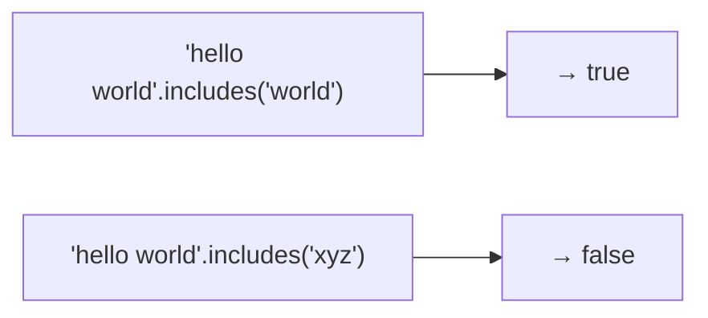
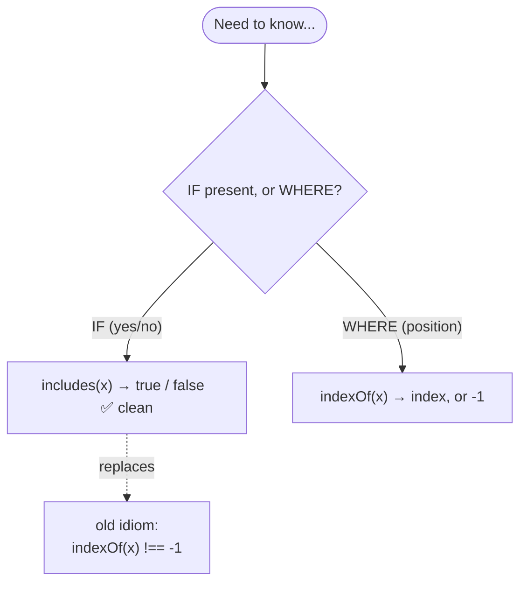
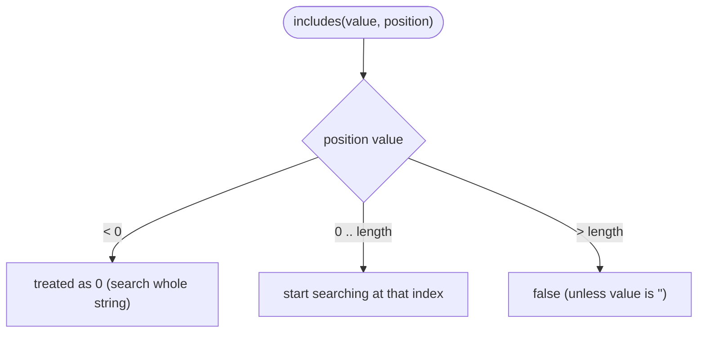
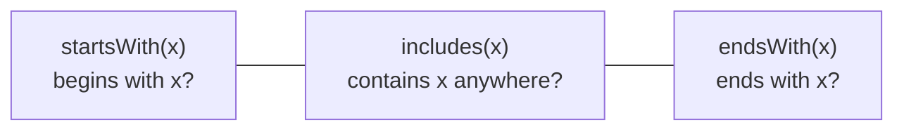

# String Method — `includes()`

> **Tip:** Open VS Code's Markdown preview with `Ctrl+Shift+V` to see the Mermaid diagrams. They also render on GitHub. See [`includes.js`](./includes.js) for runnable demos and [`includes-interview-questions.md`](./includes-interview-questions.md) for interview prep. Related: [indexOf](./indexOf.md), [charAt & charCodeAt](./charAt-and-charCodeAt.md).

`includes()` answers one simple question — **"is this substring in the string?"** — and returns a clean **`true` / `false`**. It's the ES6 replacement for the old `indexOf(...) !== -1` existence check.



Signature: **`str.includes(searchString, position?)`** — **case-sensitive**, returns a boolean, and never mutates the string.

---

## 1. The Basics

```js
const s = "hello world";
s.includes("world");  // true
s.includes("o");      // true
s.includes("xyz");    // false
s.includes("World");  // false  ← case-sensitive! ('W' ≠ 'w')
```

- Returns **`true`** if the substring occurs **anywhere**, else **`false`**.
- It tells you **IF**, never **WHERE** — for the position, use [`indexOf`](./indexOf.md).

---

## 2. `includes` vs `indexOf` — Why `includes` Exists

The pre-ES6 way to check existence was `str.indexOf(x) !== -1`, which is easy to get wrong (a match at index `0` is **falsy**, `-1` is **truthy**). `includes` removes that trap entirely.



| | `includes(x)` | `indexOf(x)` |
|---|---|---|
| Returns | `true` / `false` | index, or `-1` |
| Use for | existence check | finding the position |
| Falsy-`0` trap | none | yes (`if(indexOf)` is buggy) |
| Accepts a regex? | **no — throws** | no (coerces to string) |
| Available since | ES6 (2015) | always |

> Rule of thumb: **`includes` for yes/no, `indexOf` for the position.**

---

## 3. The `position` Argument

The optional second argument is the **index to start searching from** (default `0`).

```js
const s = "hello world";
s.includes("world", 6);  // true   ← 'world' starts at index 6
s.includes("hello", 6);  // false  ← 'hello' is before index 6, so not seen
s.includes("world", -5); // true   ← negative is treated as 0
```



---

## 4. Quirks Worth Knowing

**(a) The empty string is always "included."**
```js
"abc".includes("");   // true
"".includes("");      // true
```

**(b) Non-string arguments are coerced to strings** (same as `indexOf`).
```js
"12345".includes(23);    // true  ← 23 → "23"
"a,true,b".includes(true); // true ← true → "true"
```

**(c) ⚠️ A regex argument THROWS — this is unique to `includes`/`startsWith`/`endsWith`.**
```js
"abc".includes(/a/);  // ❌ TypeError: First argument to String.prototype.includes
                      //    must not be a regular expression
"abc".indexOf(/a/);   // -1   ← indexOf instead coerces /a/ to the string "/a/"
```

> If you need pattern matching, use `str.search(regex)` or `regex.test(str)` — not `includes`.

---

## 5. The Family — `startsWith` & `endsWith`

`includes` checks **anywhere**; its ES6 siblings check the **edges**. All three return booleans, are case-sensitive, and reject regex arguments.



```js
const f = "report.final.pdf";
f.startsWith("report");  // true
f.endsWith(".pdf");      // true
f.includes("final");     // true

// positional variants:
"hello".startsWith("llo", 2);  // true  ← treat index 2 as the start
"hello".endsWith("hell", 4);   // true  ← treat the string as if it ends at index 4
```

| Method | Checks | Optional 2nd arg |
|--------|--------|------------------|
| `includes(x, pos)` | anywhere (from `pos`) | start index |
| `startsWith(x, pos)` | at the start (from `pos`) | start index |
| `endsWith(x, endPos)` | at the end (up to `endPos`) | treat string as ending here |

---

## 6. Bonus: `String.includes` vs `Array.includes`

Arrays have an `includes` too, but it compares **whole elements** (using *SameValueZero*, so it even finds `NaN`). String `includes` matches a **substring** and coerces its argument to a string.

```js
[1, 2, NaN].includes(NaN);   // true   ← Array: finds NaN
"NaN here".includes(NaN);    // true   ← String: NaN → "NaN", which is present
[1, 2, 3].includes(2);       // true   ← exact element
"123".includes(2);           // true   ← substring "2"
```

---

## Quick Summary

- `includes(x)` → **`true` / `false`**: is `x` a substring? It tells you **IF**, not **WHERE**.
- It's the clean ES6 replacement for `indexOf(x) !== -1` (no falsy-`0` trap).
- **Case-sensitive**; optional **`position`** sets where the search starts (negative → `0`).
- The **empty string** is always included; non-string args are **coerced to strings**.
- ⚠️ Passing a **regex throws a `TypeError`** (unlike `indexOf`) — use `search`/`test` for patterns.
- Siblings: **`startsWith`** / **`endsWith`** check the edges; all return booleans.
- Use **`indexOf`** instead when you actually need the **position**.
