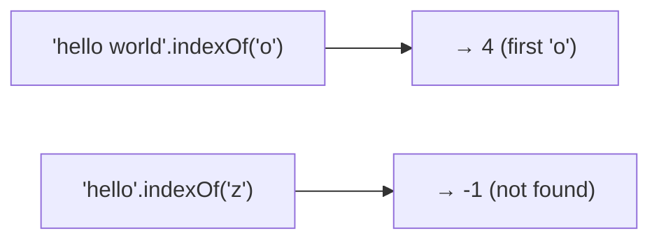
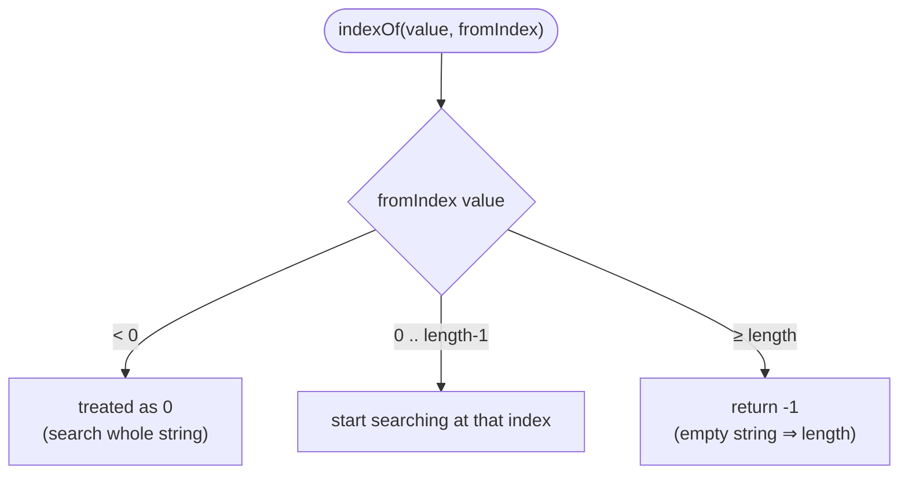
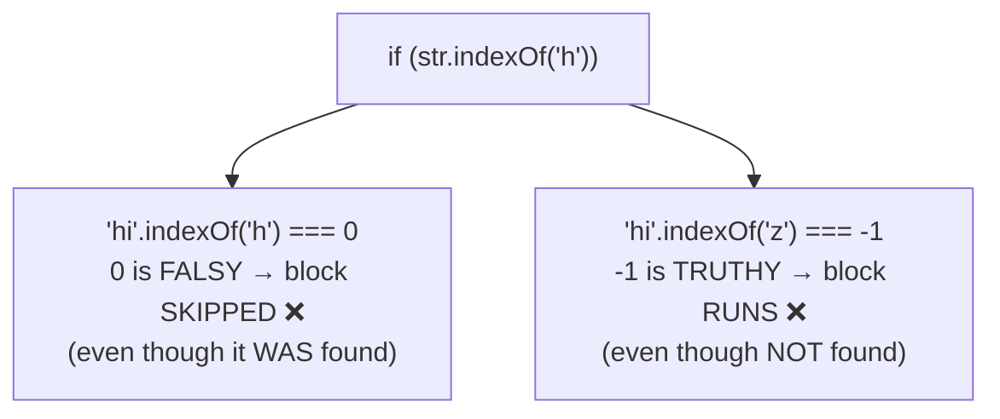
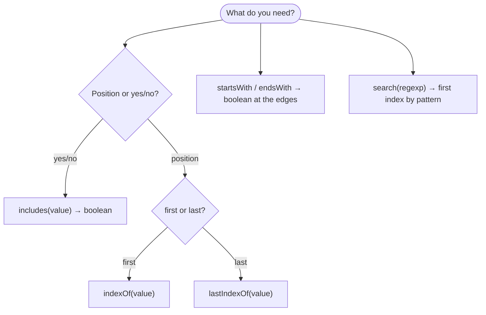

# String Method — `indexOf()`

> **Tip:** Open VS Code's Markdown preview with `Ctrl+Shift+V` to see the Mermaid diagrams. They also render on GitHub. See [`indexOf.js`](./indexOf.js) for runnable demos and [`indexOf-interview-questions.md`](./indexOf-interview-questions.md) for interview prep. Related: [charAt & charCodeAt](./charAt-and-charCodeAt.md), [Iterating over a string](./Iterating-over-string.md).

`indexOf()` answers **"where does this substring first appear?"** It returns the **index of the first match**, or **`-1`** if the substring isn't found.



Signature: **`str.indexOf(searchValue, fromIndex?)`** — search is **case-sensitive**, left-to-right, over **UTF‑16 code units**, and never mutates the string.

---

## 1. The Basics

```js
const s = "hello world";
s.indexOf("o");      // 4   ← first 'o'
s.indexOf("world");  // 6   ← index where the match starts
s.indexOf("z");      // -1  ← not found
s.indexOf("O");      // -1  ← case-sensitive! ('O' ≠ 'o')
```

- Returns the **starting index** of the first occurrence.
- For a multi-character `searchValue`, it's the index of the **first character** of the match.
- **`-1`** is the universal "not found" sentinel.

---

## 2. The `fromIndex` Argument

The optional second argument says **where to start searching** (default `0`). The search still goes **left-to-right**, just from that offset.

```js
const s = "abcabc";   // indices: a0 b1 c2 a3 b4 c5
s.indexOf("a");      // 0
s.indexOf("a", 1);   // 3   ← skip index 0, find the next 'a'
s.indexOf("a", 4);   // -1  ← no 'a' at/after index 4 (last 'a' was at 3)
```



| Call | Result | Why |
|------|--------|-----|
| `"abcabc".indexOf("b", -5)` | `1` | negative → treated as `0` |
| `"abc".indexOf("a", 5)` | `-1` | start is past the end |
| `"abc".indexOf("", 5)` | `3` | empty string → clamped to `length` |

---

## 3. Two Quirks Worth Knowing

**(a) The empty string always "matches."**
```js
"abc".indexOf("");     // 0
"abc".indexOf("", 2);  // 2
"abc".indexOf("", 99); // 3   ← clamped to str.length
```

**(b) The argument is coerced to a string.**
```js
"12345".indexOf(3);     // 2   ← number 3 → "3", found at index 2
"a,b".indexOf(true);    // -1  ← "true" not present
```

> So `indexOf` doesn't do type checks — it stringifies whatever you pass.

---

## 4. The Classic "Existence Check" — and Its Trap

The pre-ES6 idiom to test "does it contain X?" is comparing against `-1`:

```js
if (str.indexOf("x") !== -1) { /* found */ }
```

⚠️ **The trap:** `indexOf` returns `0` when the match is at the very start, and `0` is **falsy** — while `-1` (not found) is **truthy**. So a bare `if (str.indexOf(...))` is **backwards/buggy**:



**Always compare explicitly to `-1`** — or better, use **`includes()`** (ES6), which returns a clean boolean:

```js
str.includes("x");          // true / false  ← preferred when you just need yes/no
str.indexOf("x") !== -1;    // equivalent, older style
```

---

## 5. Friends & Family



**`lastIndexOf(value, fromIndex?)`** — same idea but finds the **last** occurrence, searching **backward**. Its `fromIndex` defaults to the **end** and is the highest index the match may *start* at.

```js
const s = "abcabc";
s.indexOf("b");        // 1   ← first
s.lastIndexOf("b");    // 4   ← last
s.lastIndexOf("b", 2); // 1   ← last 'b' at/before index 2
```

| Method | Returns | Direction | Default start |
|--------|---------|-----------|---------------|
| `indexOf` | first index, else `-1` | forward → | `0` |
| `lastIndexOf` | last index, else `-1` | ← backward | end |
| `includes` | `true` / `false` | forward → | `0` |

---

## 6. Pattern: Find / Count *All* Occurrences

Because `indexOf` finds only the first match, loop with an advancing `fromIndex`:

```js
function indexesOf(str, sub) {
  const positions = [];
  let i = str.indexOf(sub);
  while (i !== -1) {
    positions.push(i);
    i = str.indexOf(sub, i + 1);   // resume just past this match
  }
  return positions;
}
indexesOf("abcabcabc", "bc");   // [1, 4, 7]
```

> Resume from `i + 1` (or `i + sub.length` for non-overlapping matches). Forgetting to advance `fromIndex` causes an **infinite loop**.

---

## Quick Summary

- `indexOf(value)` → **index of first occurrence**, or **`-1`** if absent.
- For multi-char searches it's the index of the **first character** of the match.
- Optional **`fromIndex`** sets where to start (negative → `0`; `≥ length` → `-1`).
- It is **case-sensitive** and **coerces** the argument to a string; the empty string matches (clamped to `length`).
- **Existence trap:** compare to `-1` explicitly — a bare `if (str.indexOf(x))` is buggy because index `0` is falsy. Prefer **`includes()`** for yes/no.
- **`lastIndexOf`** finds the last match (searches backward); **`includes`** returns a boolean.
- To find/count **all** matches, loop with an advancing `fromIndex` (and always advance it).
