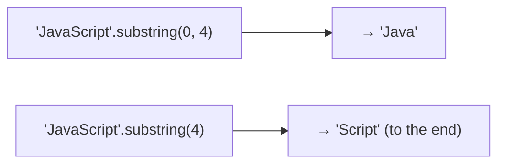
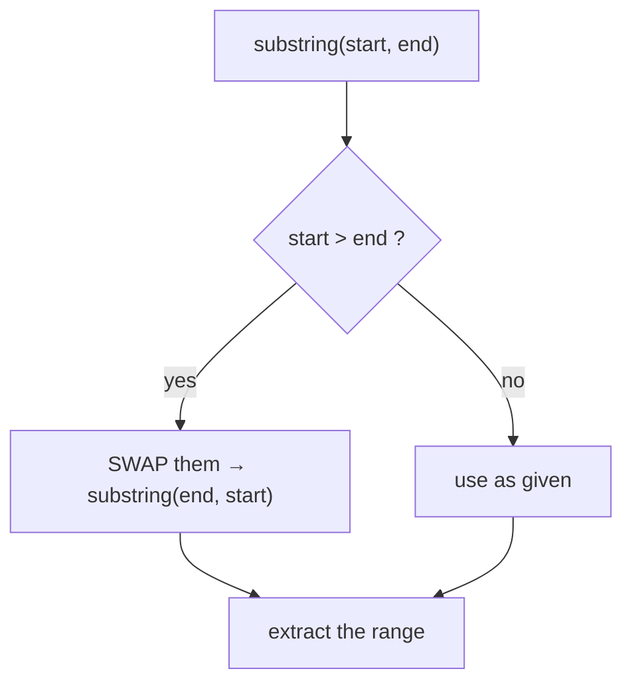
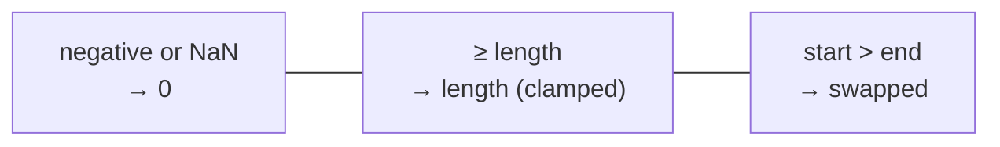
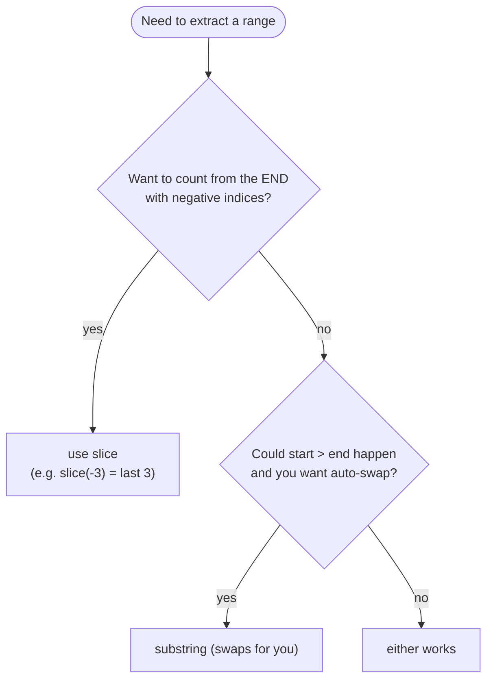

# String Method — `substring()`

> **Tip:** Open VS Code's Markdown preview with `Ctrl+Shift+V` to see the Mermaid diagrams. They also render on GitHub. See [`substring.js`](./substring.js) for runnable demos and [`substring-interview-questions.md`](./substring-interview-questions.md) for interview prep. Related: [indexOf](./indexOf.md), [toUpperCase & toLowerCase](./toUpperCase-and-toLowerCase.md).

`substring()` **extracts a slice of characters** between two indices and returns it as a **new string**. The original is never changed (strings are immutable).



Signature: **`str.substring(indexStart, indexEnd?)`** — `indexStart` is **inclusive**, `indexEnd` is **exclusive**.

---

## 1. The Basics

```
 J  a  v  a  S  c  r  i  p  t
 0  1  2  3  4  5  6  7  8  9
```

```js
const s = "JavaScript";
s.substring(0, 4);   // "Java"    ← indices 0,1,2,3 (4 is excluded)
s.substring(4);      // "Script"  ← no end ⇒ to the end of the string
s.substring(4, 6);   // "Sc"
s.substring(2, 2);   // ""        ← start === end ⇒ empty string
```

- Includes `indexStart`, **excludes** `indexEnd`.
- Length of the result = `indexEnd − indexStart` (after the rules below).
- Omitting `indexEnd` means "go to the end."

---

## 2. Quirk #1 — Arguments Get **Swapped** if `start > end`

This is `substring`'s most surprising behaviour: if `indexStart` is **greater than** `indexEnd`, it **silently swaps** them.

```js
"hello".substring(1, 4);   // "ell"
"hello".substring(4, 1);   // "ell"  ← swapped to substring(1, 4)!
```



> ⚠️ This is unique to `substring`. `slice` does **not** swap — `"hello".slice(4, 1)` returns `""`.

---

## 3. Quirk #2 — Negative / `NaN` Arguments Become `0`

`substring` does **not** understand negative indices. Any negative number (or `NaN`) is treated as **`0`**.

```js
"hello".substring(-3);     // "hello"  ← -3 → 0, so whole string
"hello".substring(-3, 2);  // "he"     ← (-3 → 0) ⇒ substring(0, 2)
"hello".substring(NaN, 3); // "hel"    ← NaN → 0
```

Indices **larger than the length** are clamped to the length:

```js
"hello".substring(2, 100); // "llo"  ← end clamped to 5
```



---

## 4. `substring` vs `slice` — The Key Comparison

They look alike (`(start, end)`, end-exclusive, return new string) but differ on **negatives** and **swapping** — this is a classic interview question.



| Behaviour | `substring(a, b)` | `slice(a, b)` |
|-----------|-------------------|---------------|
| Negative index | treated as `0` | counts **from the end** |
| `start > end` | **swaps** them | returns `""` |
| End-exclusive? | yes | yes |
| Returns new string? | yes | yes |
| `"hello".(−3)` | `"hello"` (→0) | `"llo"` (last 3) |
| `"hello".(4, 1)` | `"ell"` (swapped) | `""` |

> Quick rule: **need negative-from-the-end indices → `slice`.** Otherwise they're interchangeable for normal in-range arguments.

### And `substr` (legacy — avoid)
`str.substr(start, length)` takes a **length** as its 2nd argument (not an end index) and is **deprecated**. Prefer `substring` or `slice`.

```js
"JavaScript".substr(4, 3);   // "Scr"  ← start 4, take 3 chars (legacy)
```

---

## 5. Common Patterns

```js
// First N characters
"Hello World".substring(0, 5);          // "Hello"

// Capitalize the first letter (pairs with toUpperCase)
const s = "javaScript";
s.charAt(0).toUpperCase() + s.substring(1);   // "JavaScript"

// Extract using indexOf (e.g. the domain of an email)
const email = "user@example.com";
email.substring(email.indexOf("@") + 1);      // "example.com"

// Everything up to the first space
const full = "Ada Lovelace";
full.substring(0, full.indexOf(" "));          // "Ada"
```

These pair naturally with [`indexOf`](./indexOf.md) (to find the boundary) and [`toUpperCase`](./toUpperCase-and-toLowerCase.md).

---

## Quick Summary

- `substring(start, end)` returns the characters from `start` (**inclusive**) to `end` (**exclusive**) as a **new string**; the original is unchanged.
- Omit `end` to go to the end of the string; `start === end` gives `""`.
- **Quirk 1:** if `start > end`, the arguments are **swapped**.
- **Quirk 2:** negative / `NaN` arguments become **`0`** (no negative indexing); out-of-range indices are clamped to the length.
- **`slice`** is the alternative that supports **negative-from-the-end** indices and does **not** swap (returns `""` when `start > end`).
- `substr(start, length)` is **legacy** — prefer `substring` or `slice`.
- Pairs well with [`indexOf`](./indexOf.md) and [`toUpperCase`](./toUpperCase-and-toLowerCase.md) for extracting/formatting.
