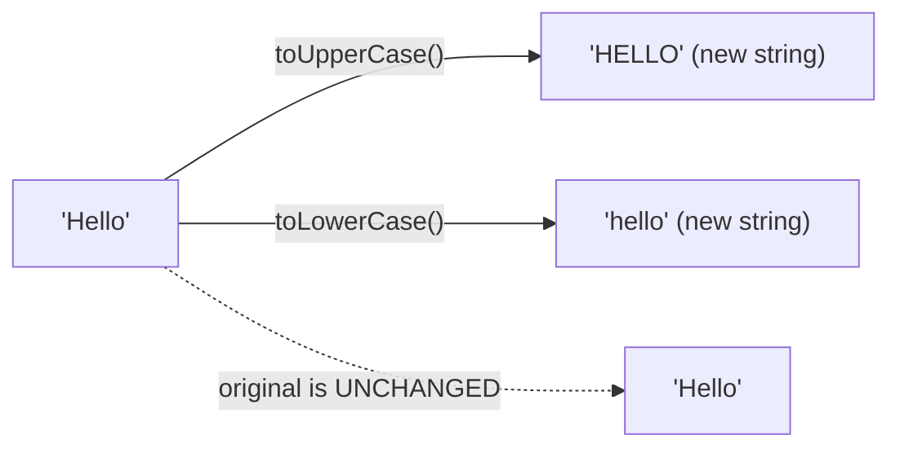
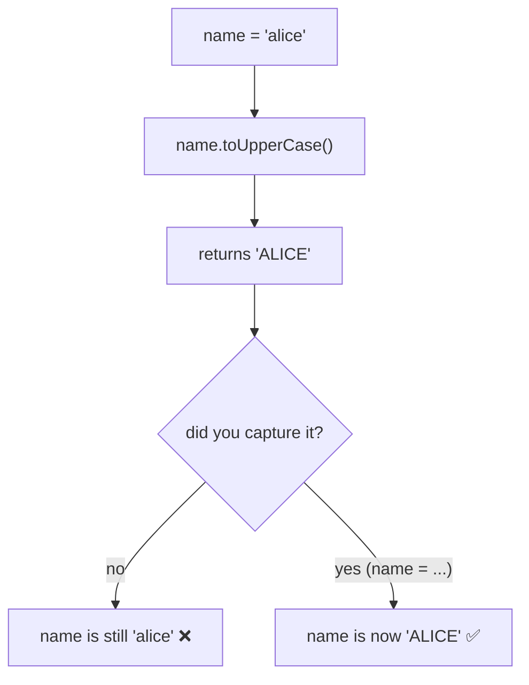
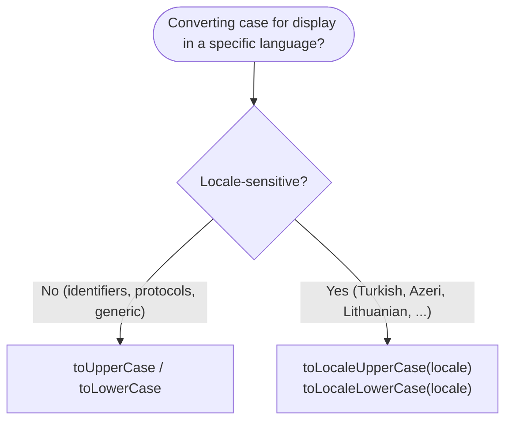
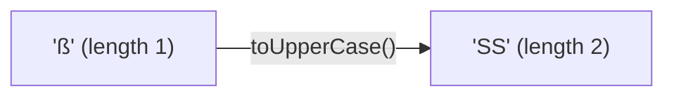

# String Methods — `toUpperCase()` & `toLowerCase()`

> **Tip:** Open VS Code's Markdown preview with `Ctrl+Shift+V` to see the Mermaid diagrams. They also render on GitHub. See [`toUpperCase-and-toLowerCase.js`](./toUpperCase-and-toLowerCase.js) for runnable demos and [`toUpperCase-and-toLowerCase-interview-questions.md`](./toUpperCase-and-toLowerCase-interview-questions.md) for interview prep. Related: [includes](./includes.md), [charAt & charCodeAt](./charAt-and-charCodeAt.md).

These two methods change a string's **case**. The single most important thing to remember: they **return a NEW string** and **never change the original** — because strings are **immutable**.



Both take **no arguments**, leave non-letters untouched, and convert accented/Unicode letters too.

---

## 1. The Basics

```js
"Hello World".toUpperCase();  // "HELLO WORLD"
"Hello World".toLowerCase();  // "hello world"

"abc123!@#".toUpperCase();    // "ABC123!@#"  ← digits & symbols unchanged
"café".toUpperCase();         // "CAFÉ"        ← accents handled
```

- Every alphabetic character is converted; **digits, spaces, punctuation pass through** unchanged.
- The result is a **brand-new string**.

---

## 2. Immutability — The #1 Gotcha

A common mistake is expecting the method to modify the variable in place:

```js
let name = "alice";
name.toUpperCase();          // returns "ALICE" but we ignored it
console.log(name);           // "alice"  ← UNCHANGED!

name = name.toUpperCase();   // ✅ must re-assign to keep the result
console.log(name);           // "ALICE"
```



> Rule: **always use the return value** — `str = str.toUpperCase()` or chain it. The original is never mutated.

---

## 3. The #1 Real-World Use — Case-Insensitive Compare

Lower-case (or upper-case) **both** sides, then compare:

```js
function equalsIgnoreCase(a, b) {
  return a.toLowerCase() === b.toLowerCase();
}
equalsIgnoreCase("Hello", "HELLO");   // true

// case-insensitive "contains" (see includes.md):
"Hello World".toLowerCase().includes("world".toLowerCase()); // true
```

This is why these methods pair so naturally with [`includes`](./includes.md) / [`indexOf`](./indexOf.md) for case-insensitive search.

---

## 4. Locale Matters — `toLocaleUpperCase` / `toLocaleLowerCase`

`toUpperCase`/`toLowerCase` use the **language-neutral** Unicode case mapping. A few languages need locale-specific rules — the classic case is **Turkish's dotted/dotless `i`**.

```js
// default (language-neutral)
"i".toUpperCase();                  // "I"
"I".toLowerCase();                  // "i"

// Turkish locale — different!
"i".toLocaleUpperCase("tr");        // "İ"  (dotted capital I)
"I".toLocaleLowerCase("tr");        // "ı"  (dotless lowercase i)
```



> Use the plain methods for **machine-facing** text (keys, URLs, comparisons); use the **Locale** variants when transforming text **for human display** in a known language.

---

## 5. The Length-Change Gotcha — German `ß`

Case conversion can change the **number of characters**. Upper-casing the German sharp-s `ß` yields **two** characters `SS`:

```js
"ß".toUpperCase();        // "SS"   (1 char → 2 chars!)
"Straße".toUpperCase();   // "STRASSE"
"Straße".length;          // 6
"Straße".toUpperCase().length; // 7  ← length grew
```



> So case conversion is **not** guaranteed to preserve length — don't assume `s.length === s.toUpperCase().length`.

---

## 6. They're String Methods Only

Numbers, booleans, etc. don't have these methods — convert to a string first:

```js
(255).toString(16).toUpperCase();   // "FF"  ← number → hex string → upper
String(true).toUpperCase();         // "TRUE"
// (255).toUpperCase()  ❌ TypeError: not a function
```

A handy capitalize-first-letter idiom combines `toUpperCase` with [`charAt`](./charAt-and-charCodeAt.md)/`slice`:

```js
const capitalize = s => s.charAt(0).toUpperCase() + s.slice(1).toLowerCase();
capitalize("jAVASCRIPT");   // "Javascript"
```

---

## 7. Comparison Table

| | `toUpperCase` / `toLowerCase` | `toLocaleUpperCase` / `toLocaleLowerCase` |
|---|---|---|
| Rules used | language-neutral Unicode mapping | locale-specific mapping |
| Argument | none | optional locale (BCP 47 tag) |
| Turkish `i`/`I` | `i`↔`I` | `i`↔`İ`, `I`↔`ı` |
| Best for | identifiers, comparisons, machine text | display text in a known language |
| Mutates original? | no (returns new string) | no (returns new string) |

---

## Quick Summary

- `toUpperCase()` / `toLowerCase()` return a **new string**; the original is **never mutated** — always capture the result.
- They take **no arguments**; **non-letters pass through**; accented letters are converted.
- Pair with [`includes`](./includes.md)/[`indexOf`](./indexOf.md) for **case-insensitive** search and comparison.
- For language-specific rules (e.g. **Turkish** `i`/`İ`/`ı`) use **`toLocaleUpperCase`/`toLocaleLowerCase`** with a locale.
- Case conversion can **change length** (German `ß` → `SS`) — don't assume length is preserved.
- They exist only on **strings** — convert numbers/booleans first (`String(x).toUpperCase()`).
