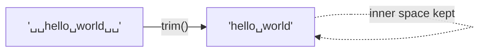
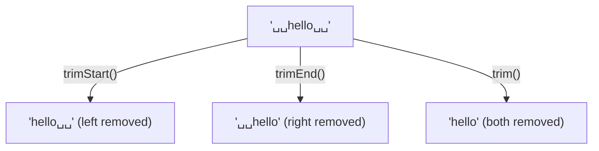
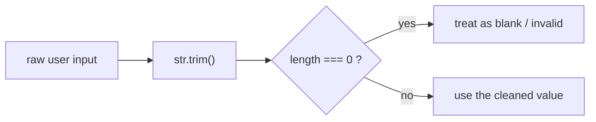
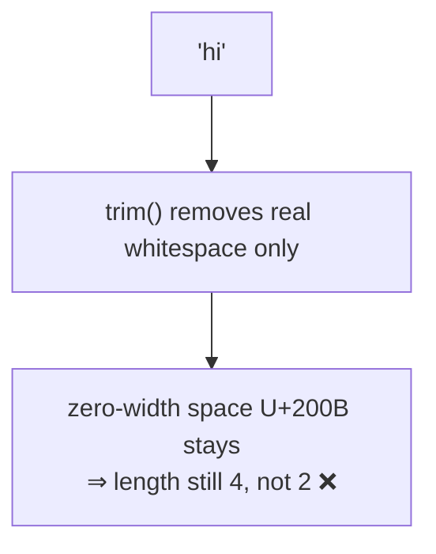

# String Method — `trim()`

> **Tip:** Open VS Code's Markdown preview with `Ctrl+Shift+V` to see the Mermaid diagrams. They also render on GitHub. See [`trim.js`](./trim.js) for runnable demos and [`trim-interview-questions.md`](./trim-interview-questions.md) for interview prep. Related: [includes](./includes.md), [substring](./substring.md).

`trim()` removes **whitespace from both ends** of a string and returns a **new string**. Whitespace **in the middle is left alone**, and the original is never changed (strings are immutable).



Signature: **`str.trim()`** — no arguments.

---

## 1. The Basics

```js
"  hello  ".trim();        // "hello"
"\t\n  hi  \n".trim();     // "hi"     ← tabs & newlines removed too
"  a b c  ".trim();        // "a b c"  ← INNER spaces preserved
"".trim();                 // ""
"      ".trim();           // ""       ← all-whitespace → empty string
```

- Strips leading **and** trailing whitespace (spaces, tabs, newlines, …).
- Whitespace **between** characters is untouched.
- Returns a **new string**; the original is unchanged.

---

## 2. The Family — `trimStart()` & `trimEnd()`

Trim only one side with the ES2019 methods (each has an older alias).



```js
"  hello  ".trimStart();   // "hello  "   (alias: trimLeft)
"  hello  ".trimEnd();     // "  hello"   (alias: trimRight)
```

| Method | Removes whitespace from | Alias |
|--------|-------------------------|-------|
| `trim()` | both ends | — |
| `trimStart()` | the **start** (left) | `trimLeft()` |
| `trimEnd()` | the **end** (right) | `trimRight()` |

> Prefer `trimStart` / `trimEnd` — `trimLeft` / `trimRight` are kept only for compatibility.

---

## 3. The #1 Use — Cleaning & Validating Input

`trim` is everywhere in form handling: users add stray spaces. Trim **before** storing, comparing, or checking for "empty."

```js
const raw = "   alice@example.com   ";
const email = raw.trim();              // "alice@example.com"

// is the field effectively blank?
function isBlank(str) {
  return str.trim().length === 0;      // or: !str.trim()
}
isBlank("   ");   // true   ← spaces only counts as blank
isBlank(" x ");   // false
```



> A bare `if (str)` is **not** an empty check — `"   "` is truthy. Use `str.trim()` first.

---

## 4. What Counts as "Whitespace"?

`trim` removes the ECMAScript **whitespace** and **line-terminator** characters — more than just the space bar:

| Character | Escape | Name |
|-----------|--------|------|
| space | `" "` (U+0020) | space |
| tab | `\t` (U+0009) | horizontal tab |
| line feed | `\n` (U+000A) | newline |
| carriage return | `\r` (U+000D) | CR |
| vertical tab | `\v` (U+000B) | VT |
| form feed | `\f` (U+000C) | FF |
| no-break space | ` ` | NBSP |
| BOM | `` | zero-width no-break space |
| Unicode spaces | `
`, `
`, `　`, … | line/para separators, ideographic space |

```js
" hi ".trim();   // "hi"   ← NBSP IS trimmed
```

---

## 5. The Gotcha — Zero-Width Space Is **Not** Trimmed

The **zero-width space** `​` (often pasted in from the web) is **not** classified as whitespace, so `trim` leaves it in place. The string looks clean but isn't.

```js
const sneaky = "​hi​";
sneaky.trim();          // "​hi​"  ← LOOKS like "hi" but ZWSP remains
sneaky.trim().length;   // 4       ← not 2!
```



> If invisible characters survive a `trim`, suspect zero-width/control characters. Remove them explicitly with a regex, e.g. `str.replace(/​/g, "")`.

---

## 6. `trim` vs Other Approaches

- `trim()` only touches the **ends** — to collapse **inner** runs of spaces, use a regex: `str.replace(/\s+/g, " ").trim()`.
- It does **not** remove punctuation or quotes — only whitespace.

```js
"  multiple   inner   spaces  ".replace(/\s+/g, " ").trim();
// "multiple inner spaces"
```

---

## Quick Summary

- `trim()` removes whitespace from **both ends** and returns a **new string**; **inner** whitespace is preserved and the original is unchanged.
- **`trimStart()`** / **`trimEnd()`** trim one side (aliases `trimLeft` / `trimRight`).
- The **#1 use** is cleaning/validating user input — `str.trim().length === 0` (or `!str.trim()`) is the proper "blank" check; a bare `if (str)` isn't.
- "Whitespace" covers spaces, tabs, newlines, CR, VT, FF, **NBSP**, BOM, and Unicode separators.
- **Gotcha:** the **zero-width space** `​` is *not* whitespace, so `trim` won't remove it — strip it with a regex.
- To collapse **inner** spaces, use `replace(/\s+/g, " ")`, not `trim`.
