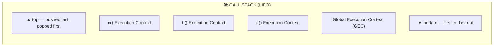
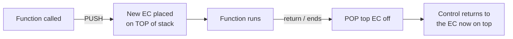
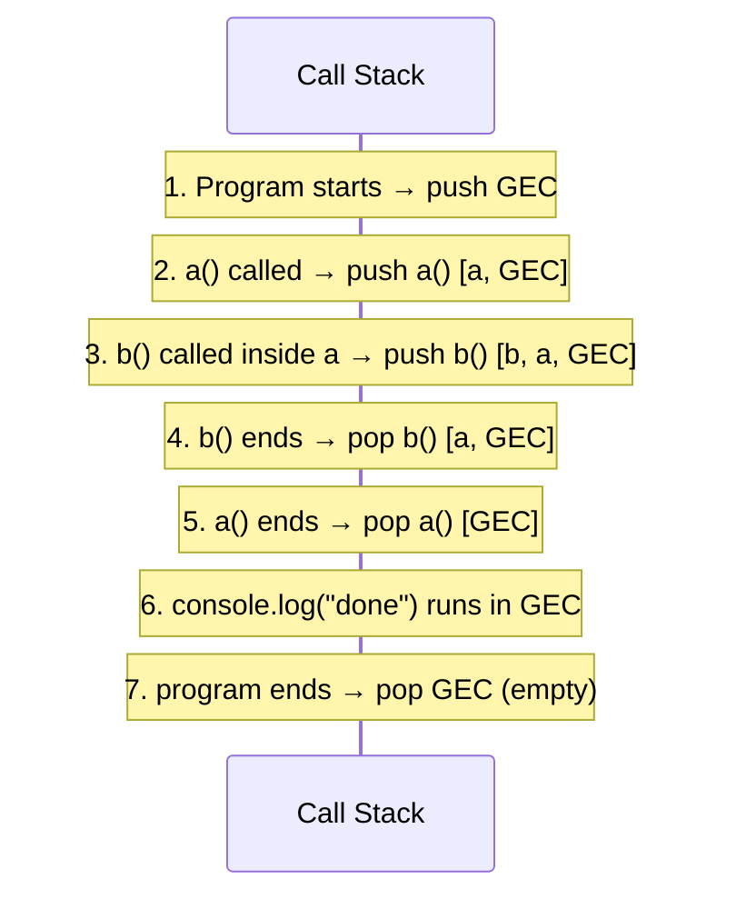
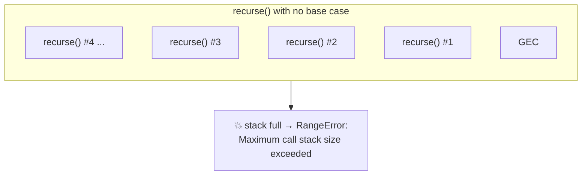
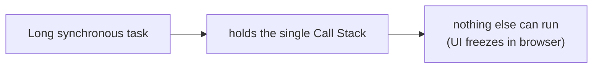

# The Call Stack in JavaScript

> **Tip:** Open VS Code's Markdown preview with `Ctrl+Shift+V` to see the Mermaid diagrams. They also render on GitHub. See [`Call-stack.js`](./Call-stack.js) for runnable demos.

Builds on [Execution Context](./Execution-context.md) and [How JS Executes Code](./How-JS-executes-code.md). Here we focus on the **one data structure** the engine uses to keep track of where it is: the **Call Stack**.

---

## 1. What Is the Call Stack?

The **Call Stack** is a data structure that records **which execution context is currently running** and where to return when it finishes. It follows **LIFO** — **L**ast **I**n, **F**irst **O**ut.

- The engine has exactly **one** Call Stack → JavaScript is **single-threaded**.
- The Global Execution Context (GEC) sits at the **bottom**.
- Every function call **pushes** a new Execution Context on **top**.
- Every `return` (or function end) **pops** the top context off.



> **Other names:** Execution Context Stack, Program Stack, Control Stack, Runtime Stack, Machine Stack.

---

## 2. Push & Pop — The Two Operations



The engine **always runs whatever is on top**. It cannot touch a lower frame until everything above it has been popped.

---

## 3. Worked Example

```js
function a() {
  console.log("inside a");
  b();           // pushes b on top of a
}
function b() {
  console.log("inside b");
}

a();             // pushes a on top of GEC
console.log("done");
```

### Step-by-step stack states



| Step | Event | Stack (top → bottom) |
|------|-------|----------------------|
| 1 | Program starts | `GEC` |
| 2 | `a()` called | `a`, `GEC` |
| 3 | `b()` called | `b`, `a`, `GEC` |
| 4 | `b()` returns | `a`, `GEC` |
| 5 | `a()` returns | `GEC` |
| 6 | `"done"` logged | `GEC` |
| 7 | Program ends | *(empty)* |

---

## 4. Stack Overflow 💥

Because the stack has a **finite size**, infinite/too-deep recursion keeps pushing frames that never pop — until the stack is full. The engine then throws:

```
RangeError: Maximum call stack size exceeded
```



A correct recursive function has a **base case** that lets frames `return` and pop before the stack fills.

---

## 5. Why It Matters



- Only **one** stack → one task at a time → **single-threaded**.
- A slow function **blocks** everything below it.
- Async work (timers, fetch, promises) is **not** placed directly on the stack — the runtime/event loop queues those callbacks and pushes them **only when the stack is empty**.

---

## Quick Summary

- The **Call Stack** tracks the currently executing execution context (**LIFO**).
- **Push** on every function call; **pop** on every `return` / function end.
- The engine always runs the **top** frame; GEC is at the **bottom**.
- There is exactly **one** stack → JavaScript is **single-threaded**.
- Too-deep recursion → **`RangeError: Maximum call stack size exceeded`**.
- A blocked stack blocks the whole program; async callbacks wait until it clears.
