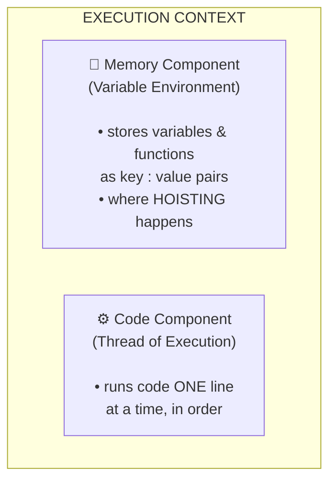
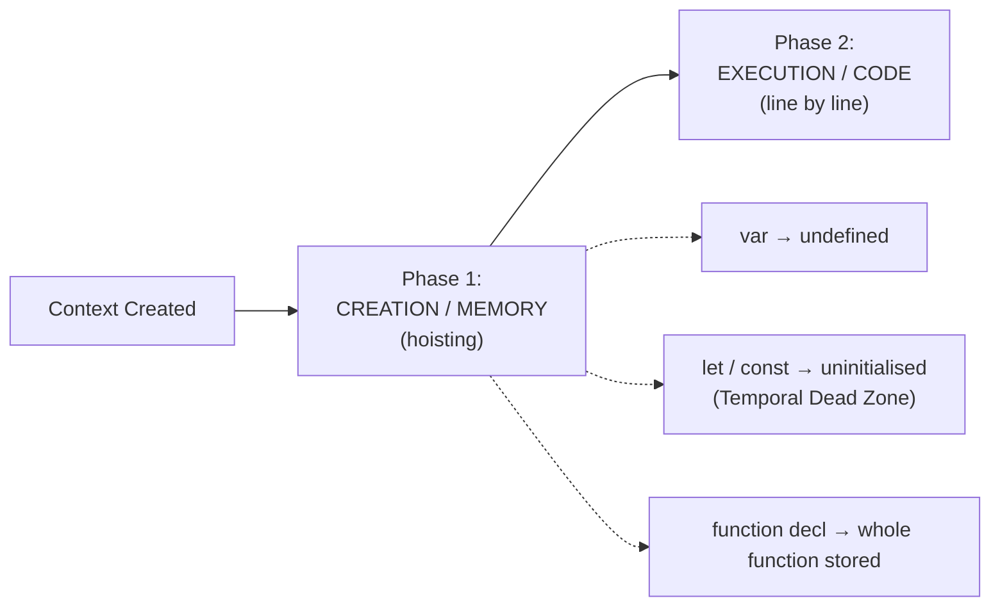
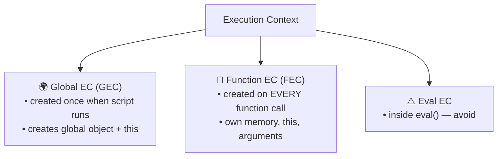
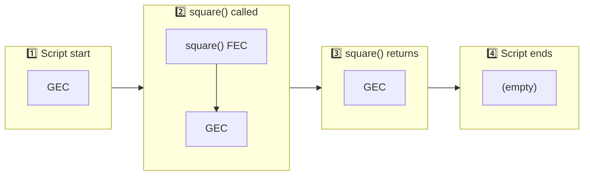
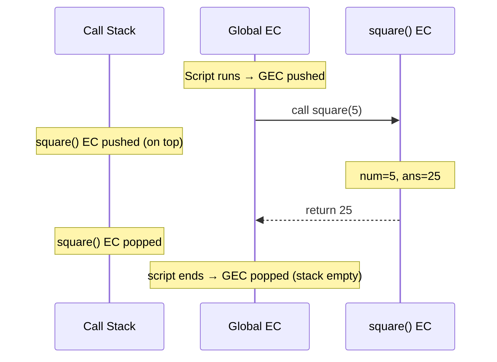

# JavaScript Execution Context — Complete Guide

> **Tip:** Open VS Code's Markdown preview with `Ctrl+Shift+V` to see the Mermaid diagrams rendered as real visuals. They also render automatically on GitHub.

Everything in JavaScript happens inside an **Execution Context (EC)** — a sealed environment in which a piece of JS code is evaluated and executed. It holds the variables, functions, the value of `this`, and a reference to the outer (lexical) environment.

---

## 1. The Two Components of an Execution Context



JavaScript is **single-threaded** (one command at a time) and **synchronous** (in order, finishing each line before the next).

---

## 2. The Two Phases of Execution

When **any** execution context is created, it runs in two phases:



| Phase | What happens |
|-------|-------------|
| **1. Creation / Memory** | Memory is allocated. `var` → `undefined`, `let`/`const` → uninitialised (TDZ), function declarations → entire function stored. |
| **2. Execution / Code** | Code runs line by line; values are assigned and functions are invoked. Each invocation creates a brand-new context. |

---

## 3. Types of Execution Context



- **Global (GEC):** only one per program. Creates the global object (`window` in browsers, `globalThis` in Node) and points `this` to it.
- **Function (FEC):** created each time a function is invoked.
- **Eval:** created inside `eval()`; rarely used.

---

## 4. The Call Stack (Execution Context Stack)

The **Call Stack** manages the order of execution contexts using **LIFO** (Last In, First Out): the GEC is pushed first, each function call pushes a new FEC on top, and each return pops it off.



> Also known as: Program Stack, Control Stack, Runtime Stack, Machine Stack.

---

## 5. Putting It Together — Sequence of a Function Call



---

## 6. Code Examples

### Hoisting (proving the two phases)
```js
console.log(x);   // undefined  → var hoisted, not yet assigned
getName();        // "Hello"    → function fully hoisted

var x = 7;
function getName() { console.log("Hello"); }

console.log(x);   // 7  → assigned during execution phase
```

### Temporal Dead Zone (let / const)
```js
console.log(y);   // ❌ ReferenceError: Cannot access 'y' before initialization
let y = 10;
```

### Function Execution Contexts
```js
var n = 5;
function square(num) {
  var ans = num * num;   // new EC: num & ans live here
  return ans;
}
var square2 = square(n);  // FEC pushed, runs, popped
var square4 = square(4);  // another FEC
```

---

## Quick Summary

- **Execution Context** = environment where JS runs (Memory + Code components).
- **GEC** created once; **FEC** created on every function call.
- Each EC runs in **two phases**: Creation (hoisting) → Execution.
- The **Call Stack** tracks the currently running context (LIFO).
- `var` hoists as `undefined`; `let`/`const` sit in the **Temporal Dead Zone**.
- JS engine is **single-threaded & synchronous**; async work is handled by the runtime via the event loop, callback & microtask queues.

---

> 📄 See [`Execution-context.js`](./Execution-context.js) for the runnable code demonstrations.
