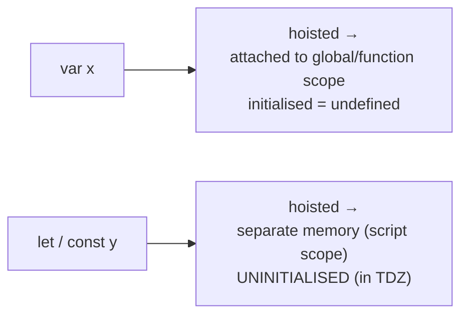
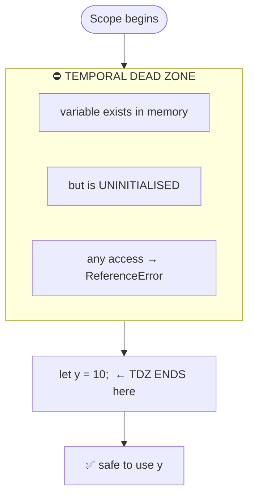
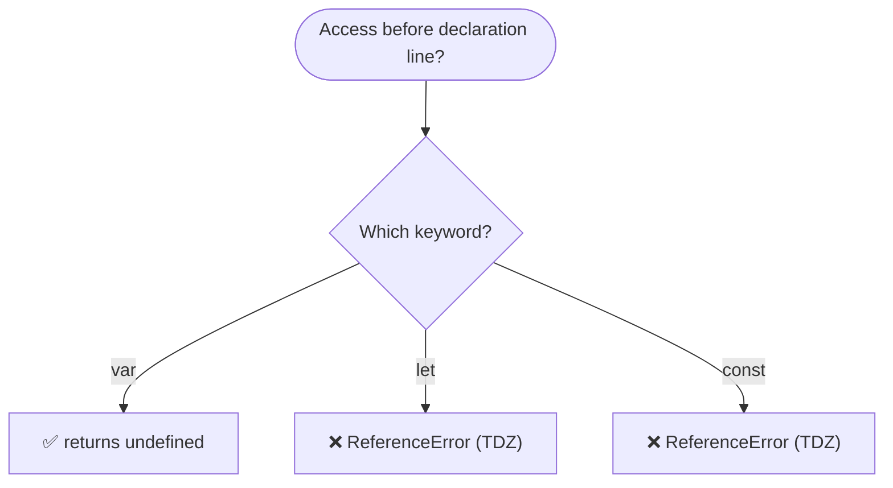
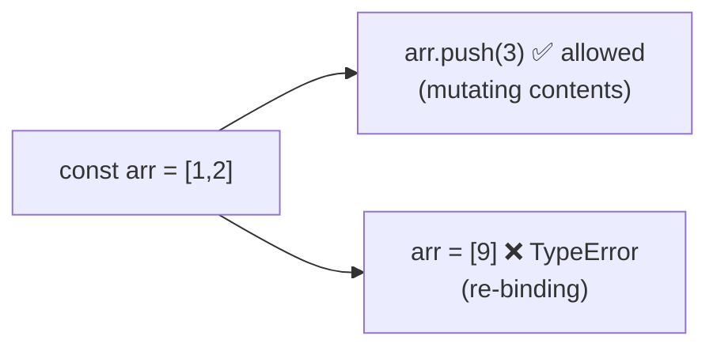
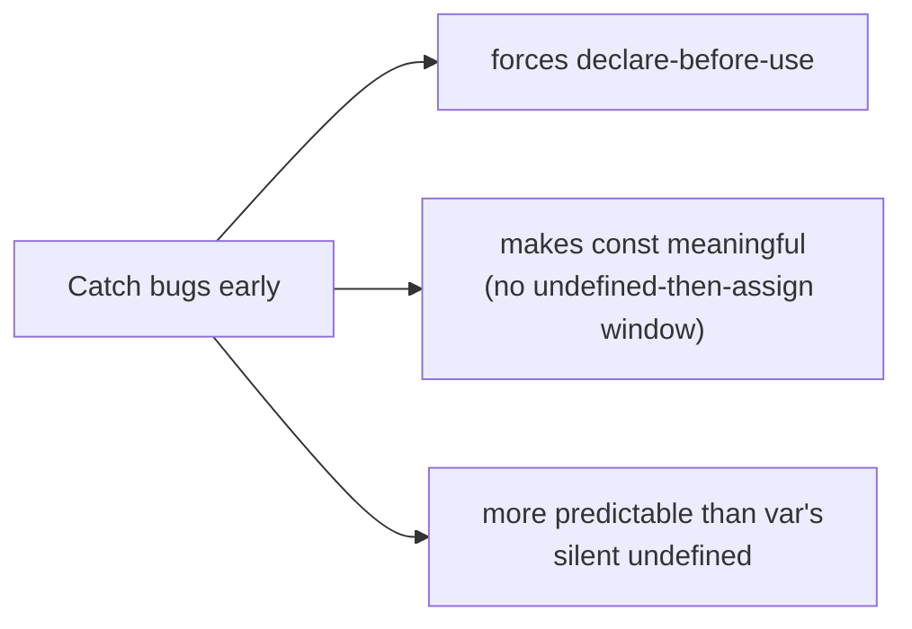

# Hoisting — `let`, `const` & the Temporal Dead Zone (TDZ)

> **Tip:** Open VS Code's Markdown preview with `Ctrl+Shift+V` to see the Mermaid diagrams. They also render on GitHub. See [`Hoisting-let-const-and-TDZ.js`](./Hoisting-let-const-and-TDZ.js) for runnable demos and [`Hoisting-let-const-and-TDZ-interview-questions.md`](./Hoisting-let-const-and-TDZ-interview-questions.md) for interview prep.

Builds on [Hoisting — var & function](./Hoisting-var-and-function.md). A common myth is that `let` and `const` are **not** hoisted. They **are** — they just behave very differently from `var` because of the **Temporal Dead Zone**.

---

## 1. The Key Idea

`let` and `const` declarations **are hoisted**, but unlike `var` they are **not initialised to `undefined`**. They are placed in a separate memory space and stay **uninitialised** until the engine reaches their declaration line. The period between entering the scope and that line is the **Temporal Dead Zone (TDZ)**.



Accessing a `let`/`const` while it is in the TDZ throws:
```
ReferenceError: Cannot access 'y' before initialization
```

---

## 2. What Is the Temporal Dead Zone?

The **TDZ** is the time span from the **start of the scope** until the line where the variable is **declared & initialised**. While a variable is in the TDZ, any read/write throws a `ReferenceError`.



```js
// TDZ for y starts here ──┐
console.log(y);          // │  ❌ ReferenceError (still in TDZ)
let y = 10;              // ◄┘  TDZ ends — y now initialised
console.log(y);          //     ✅ 10
```

---

## 3. `var` vs `let` vs `const`



| Feature | `var` | `let` | `const` |
|---------|-------|-------|---------|
| Hoisted? | ✅ Yes | ✅ Yes | ✅ Yes |
| Initial value when hoisted | `undefined` | **uninitialised (TDZ)** | **uninitialised (TDZ)** |
| Access before declaration | `undefined` | `ReferenceError` | `ReferenceError` |
| Scope | function | block `{ }` | block `{ }` |
| Re-declaration in same scope | ✅ allowed | ❌ SyntaxError | ❌ SyntaxError |
| Re-assignment | ✅ | ✅ | ❌ (TypeError) |
| Must initialise at declaration | ❌ | ❌ | ✅ required |
| Attaches to global object (`window`) | ✅ | ❌ | ❌ |

---

## 4. `const` Extra Rules

`const` adds two rules on top of `let`:

1. **Must be initialised** at declaration — `const x;` → `SyntaxError: Missing initializer in const declaration`.
2. **Cannot be re-assigned** — `x = 5` later → `TypeError: Assignment to constant variable`.

> ⚠️ `const` makes the **binding** constant, **not** the value. Object/array contents can still be mutated.



---

## 5. Why Does the TDZ Exist?



The TDZ is a **deliberate design choice**: `var`'s silent `undefined` hides bugs, whereas `let`/`const` fail loudly if you use a variable too early.

---

## 6. Block Scope + TDZ Together

Each block `{ }` creates a fresh scope with its own TDZ.

```js
let x = "outer";
{
  // TDZ for the inner x starts at the block's top
  console.log(x);   // ❌ ReferenceError (inner x shadows outer, still in TDZ)
  let x = "inner";
  console.log(x);   // ✅ "inner"
}
```

---

## Quick Summary

- `let` & `const` **are hoisted**, but stay **uninitialised** in the **Temporal Dead Zone**.
- TDZ = from scope start → the declaration line; access inside it throws **`ReferenceError`**.
- `var` returns `undefined` early; `let`/`const` throw — by design, to catch bugs.
- `let`/`const` are **block-scoped**; `var` is **function-scoped**.
- `const` must be initialised and cannot be re-assigned (but objects/arrays can still be mutated).
- `let`/`const` do **not** attach to the global object; `var` does.
