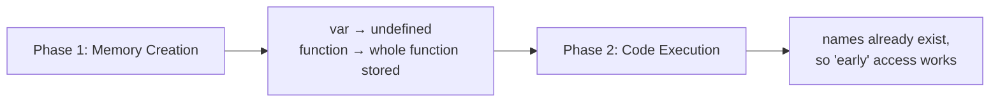
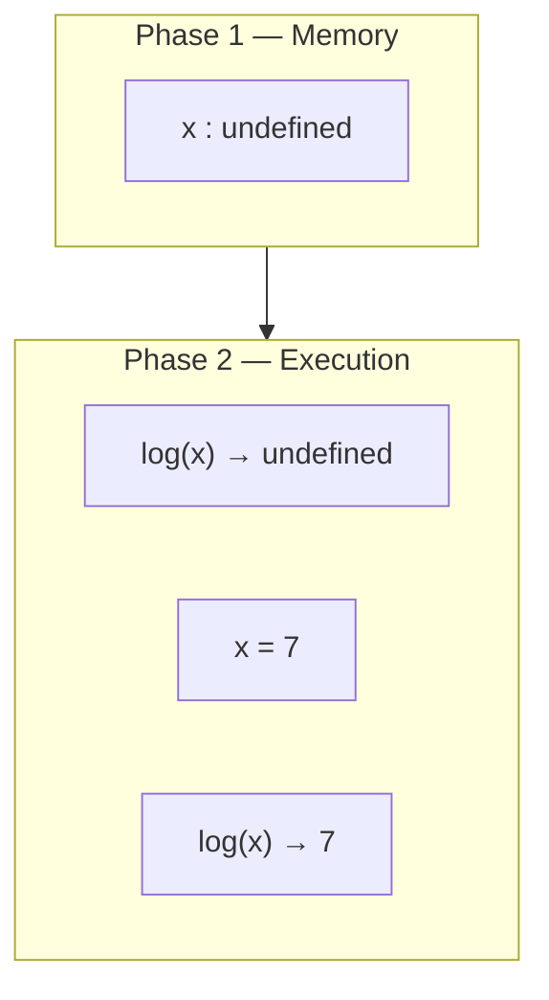
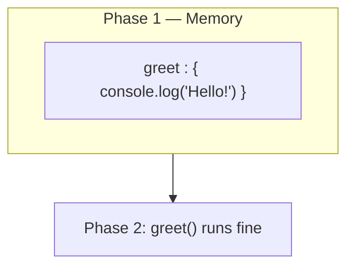
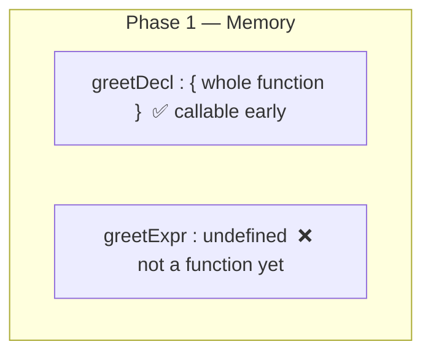
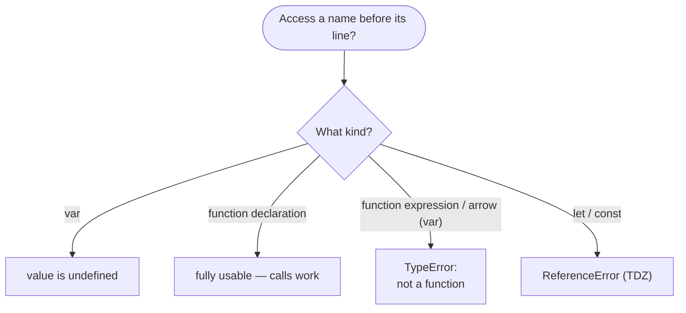

# Hoisting in JavaScript — `var` & `function`

> **Tip:** Open VS Code's Markdown preview with `Ctrl+Shift+V` to see the Mermaid diagrams. They also render on GitHub. See [`Hoisting-var-and-function.js`](./Hoisting-var-and-function.js) for runnable demos and [`Hoisting-var-and-function-interview-questions.md`](./Hoisting-var-and-function-interview-questions.md) for interview prep.

Builds on [Execution Context](./Execution-context.md) and [How JS Executes Code](./How-JS-executes-code.md). Hoisting is a **direct consequence of the Memory Creation phase** of the execution context.

---

## 1. What Is Hoisting?

**Hoisting** is JavaScript's behaviour of letting you access variables and functions **before** the line where they are written — because memory for them is allocated during **Phase 1 (Memory Creation)**, *before* any code runs.

> Nothing is physically "moved to the top." The engine simply **allocates memory first**, so the names already exist when execution begins.



---

## 2. How `var` Is Hoisted

A `var` declaration is hoisted and **initialised to `undefined`**. So using it before its line gives `undefined` (not an error, and not its later value).

```js
console.log(x); // undefined  ← hoisted, value not assigned yet
var x = 7;
console.log(x); // 7          ← assigned during execution phase
```



---

## 3. How `function` Is Hoisted

A **function declaration** is hoisted with its **entire body**. So you can call it before it appears in the code.

```js
greet();                       // "Hello!"  ← works, whole function hoisted
function greet() {
  console.log("Hello!");
}
```



---

## 4. The Big Gotcha — Function **Expressions** & Arrow Functions

When a function is assigned to a `var`, only the **variable** is hoisted (as `undefined`) — **not** the function body. Calling it early throws `TypeError: ... is not a function`.

```js
greetDecl();   // ✅ "I am a declaration"
greetExpr();   // ❌ TypeError: greetExpr is not a function

function greetDecl() { console.log("I am a declaration"); }
var greetExpr = function () { console.log("I am an expression"); };
```



> The same applies to **arrow functions** assigned to `var`/`let`/`const` — they behave like expressions, not declarations.

---

## 5. `var` vs `function` Hoisting at a Glance

| Thing | Hoisted? | Initial value in memory | Use before declaration? |
|-------|----------|-------------------------|-------------------------|
| `var x` | ✅ Yes | `undefined` | Returns `undefined` |
| `function f(){}` (declaration) | ✅ Yes | **entire function** | ✅ Works |
| `var f = function(){}` (expression) | ✅ variable only | `undefined` | ❌ `TypeError` |
| `var f = () => {}` (arrow) | ✅ variable only | `undefined` | ❌ `TypeError` |

> `let` / `const` are also hoisted but stay **uninitialised** in the **Temporal Dead Zone** → accessing early throws `ReferenceError`. (Covered in [Execution Context](./Execution-context.md); a dedicated topic can follow.)

---

## 6. Decision Flow



---

## Quick Summary

- **Hoisting** = names exist before execution because memory is allocated in **Phase 1**.
- `var` → hoisted as **`undefined`** (early access returns `undefined`, no error).
- **Function declarations** → hoisted **whole** → callable before their line.
- **Function expressions / arrow functions** assigned to `var` → only the variable hoists as `undefined` → calling early throws **`TypeError`**.
- `let` / `const` → hoisted but in the **Temporal Dead Zone** → early access throws **`ReferenceError`**.
- Nothing is physically moved; the engine just reserves memory first.
