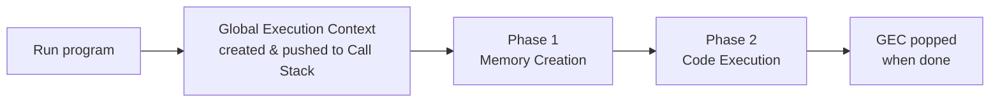
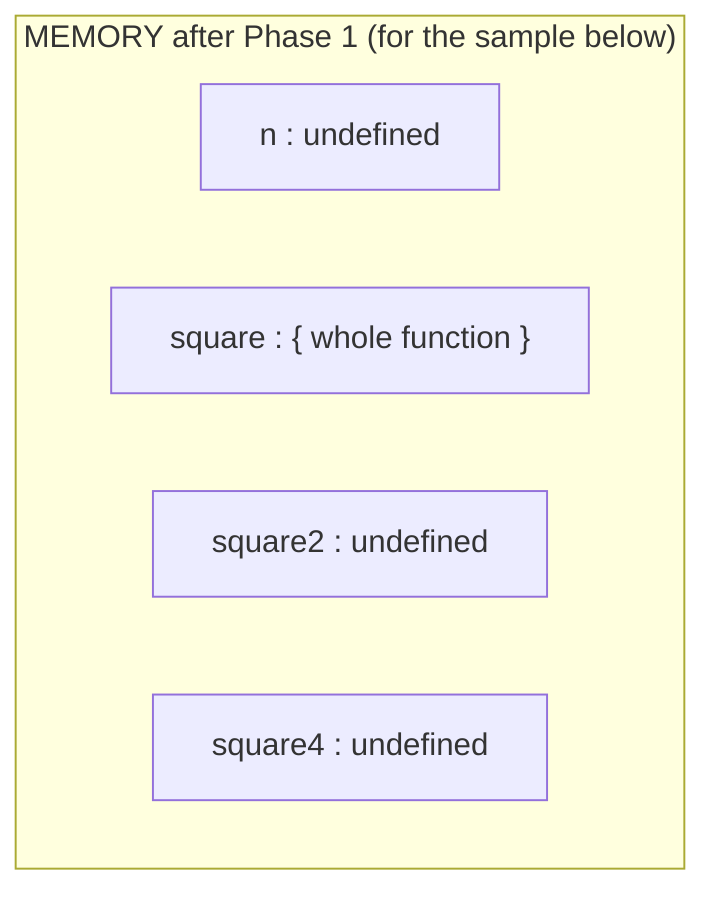
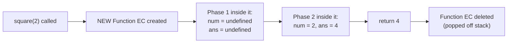
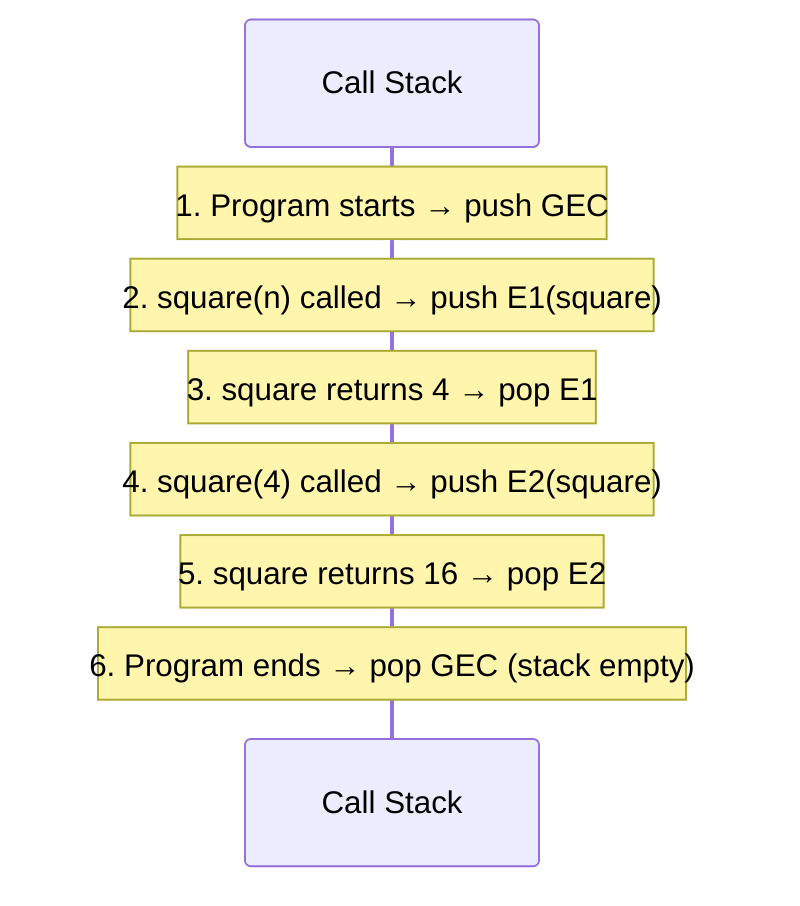
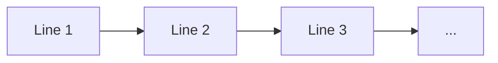
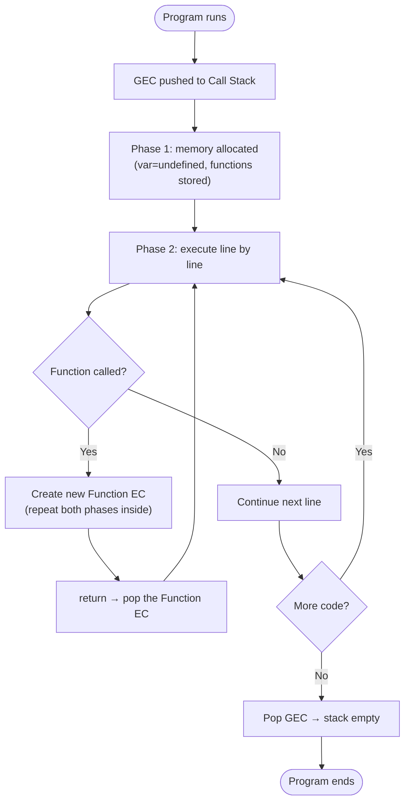

# How JavaScript Executes Code

> **Tip:** Open VS Code's Markdown preview with `Ctrl+Shift+V` to see the Mermaid diagrams. They also render on GitHub. See [`How-JS-executes-code.js`](./How-JS-executes-code.js) for runnable demos.

This builds directly on the [Execution Context](./Execution-context.md) topic. Here we trace **exactly what the JS engine does, step by step**, when it runs a program.

---

## 1. The Big Picture

When you run a JS program, an **Execution Context** is created and pushed onto the **Call Stack**. The engine then processes the code in **two phases**.



---

## 2. Phase 1 — Memory Creation (Hoisting)

The engine scans the **whole** code first, line by line, and allocates memory **before running anything**.

- `var` variables → reserved with the placeholder value **`undefined`**.
- Function declarations → the **entire function code** is copied into memory.
- `let` / `const` → memory reserved but left **uninitialised** (Temporal Dead Zone).



**Sample program used throughout this topic:**
```js
var n = 2;
function square(num) {
  var ans = num * num;
  return ans;
}
var square2 = square(n);
var square4 = square(4);
```

---

## 3. Phase 2 — Code Execution

Now the engine runs the code line by line, filling in real values and **invoking functions**.

1. `n = 2` → placeholder `undefined` is replaced by `2`.
2. `function square` → nothing to do (already in memory).
3. `square2 = square(n)` → **a new Function Execution Context is created** and pushed onto the stack.

### What happens on each function invocation



When the function hits `return`, its value is handed back to where it was called, and that **whole function context is destroyed** — it is popped off the Call Stack.

---

## 4. The Call Stack Through the Whole Program

The Call Stack (LIFO) is what the engine uses to keep track of *where it is*.



| Step | Action | Stack (top → bottom) |
|------|--------|----------------------|
| 1 | Program starts | `GEC` |
| 2 | `square(n)` called | `E1(square)`, `GEC` |
| 3 | `square` returns 4 | `GEC` |
| 4 | `square(4)` called | `E2(square)`, `GEC` |
| 5 | `square` returns 16 | `GEC` |
| 6 | Program ends | *(empty)* |

---

## 5. Why "Single-Threaded & Synchronous"?



- **Single-threaded:** the engine has **one** Call Stack, so it does **one thing at a time**.
- **Synchronous:** it executes in order — it will not move to the next line until the current one finishes.
- Long-running code therefore **blocks** the stack. (Async behaviour — timers, fetch, promises — is provided by the *runtime* around the engine via the event loop, not by the engine itself.)

---

## 6. Step-by-Step Recap



---

## Quick Summary

- A program run creates the **Global Execution Context**, pushed onto the **Call Stack**.
- Every EC runs in **two phases**: Memory Creation (hoisting) → Code Execution.
- Each **function call** creates a new Function EC that repeats both phases, then is **popped** on `return`.
- The **Call Stack** (LIFO) tracks the currently executing context.
- The JS engine is **single-threaded & synchronous** — one Call Stack, one task at a time.
